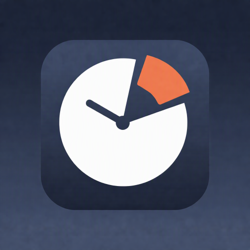

<div align="center">



# ClockMods Ultimate · Compose

**把时间、日历与天气，变成属于你的桌面**

十二套时钟主题 · 五套日历主题 · 世界时钟 · 桌面小组件 · 无广告

</div>

本分支以 **Kotlin、Jetpack Compose 与 Material 3** 实现 ClockMods Ultimate，提供可定制的全屏时钟、主题化日历与实用工具。适合希望在 Android 12+ 手机、平板或桌面屏幕上组合时间、日期和天气的用户。

[核心亮点](#核心亮点) · [版本选择](#版本选择) · [快速上手](#快速上手) · [开发与构建](#开发与构建) · [许可与致谢](#许可与致谢)

## 核心亮点

- **十二套完整时钟主题**：数字、模拟与混合布局，从经典大字、玻璃和纸张到五套 Material 风格；每套主题按自身能力提供外观与动效设置。
- **五套日历布局**：深色仪表盘、纯黑、宣纸、排版海报与周程视图，结合离线农历、节气、节日、宜忌及天气信息。
- **同一屏幕上的世界时间**：双块、轨道、气泡、混合、丝带支持最多六个城市，可按城市、国家或时区搜索并调整顺序。
- **四类桌面小组件**：数字时钟、模拟时钟、时钟天气、日期日历；六套小组件主题，每个实例保存自己的时区与显示配置。
- **细致的显示定制**：主题配色、自动文字对比色、卡片阴影、字体与比例，图片背景支持高斯模糊和压暗；提供可配置像素微移与自动压暗。
- **信息与动效兼顾**：七种数字 / 天气过渡、自定义留言滚动、摄氏 / 华氏切换，以及整点 / 半点报时的六种视觉效果。
- **常用工具就在手边**：全屏时钟、日历、番茄钟、闹钟、倒计时和秒表；简体 / 繁體 / English，无需账号。

## 主题与工具

### 十二套时钟主题

| 主题 | 类型 | 视觉特点 |
| --- | --- | --- |
| Pro Classic / Pro 经典 | 数字 | 熟悉的大字时间与完整基础设置 |
| Glass Atelier / 光影工坊 | 模拟 | 玻璃质感与指针表盘 |
| Noir Instrument / 黑曜仪表 | 模拟 | 深色仪表布局 |
| Paper Station / 纸上车站 | 模拟 | 纸张与排版风格 |
| Orbit Neon / 轨道霓虹 | 混合 | 霓虹轨道与数字时间 |
| Digital Grid / 数字网格 | 数字 | 网格化数字布局 |
| Typographic / 字形时刻 | 数字 | 以字体与排版呈现时间 |
| 双块 | 数字 | 成组时间卡片，支持世界时钟 |
| 轨道 | 混合 | 环形布局，支持世界时钟 |
| 气泡 | 数字 | 圆润气泡布局，支持世界时钟 |
| 混合 | 混合 | 几何块面与圆泡布局，支持世界时钟 |
| 丝带 | 数字 | 横向条带布局，支持世界时钟 |

设置会根据当前主题能力显示。适用的数字布局可选淡变、上滑、下滑、缩放、翻转、右滑、扫描；天气过渡可独立配置，或跟随数字动效。适用的指针布局可选择平滑扫秒、跳秒或关闭秒针。

主题的配色与动效可以分别保存。图片模糊只作用于图片背景；纯色背景保持纯色显示。时间制、秒数、日期表达式、时区、字体和辅助文字比例等设置按布局能力提供。

### 五套日历主题

| 主题 | 布局与信息 |
| --- | --- |
| 石墨深空 | 深色仪表盘，结合时间、月历、天气、预报与日期详情 |
| 纯黑碳素 | 纯黑风格仪表盘，适合深色显示偏好 |
| 宣纸水墨 | 纸张风格月历与农历 / 宜忌信息 |
| 墨白排版 | 以月份标题和日期网格为主体的海报式布局 |
| 靛蓝周程 | 周视图，结合天气、预报和所选日期详情 |

不同主题的信息模块与导航方式各有侧重，可按布局切换月份 / 周、选择日期或回到今天。周起始日与周末高亮可配置。

农历、二十四节气、传统与公历节日、数九 / 三伏和每日宜忌由 [tyme4j](https://github.com/6tail/tyme4j) 在设备端计算。法定节假日的「休 / 班」安排使用随应用打包的 [holiday-cn](https://github.com/NateScarlet/holiday-cn) 数据；只有已收录年份能显示对应安排，不能从农历推算未来的调休。日历本身无需联网。

### 四类桌面小组件

在桌面长按添加数字时钟、模拟时钟、时钟天气或日期日历卡片。可选系统动态色、玻璃、深色仪表、纸张、霓虹、透明六套主题；小组件外观独立于全屏时钟主题。

每个实例可配置时区、系统或固定时间制、显示模块、透明度、文字比例及点击行为。卡片设置按钮用于重新配置，取消不会覆盖原配置。小组件使用适合桌面宿主的系统字体，与全屏时钟的字体选择有所区别。

时间由系统 `TextClock` / `AnalogClock` 驱动，日期按实例时区更新；天气每 30 分钟尝试刷新，也可点击天气区域手动刷新，离线保留缓存与更新时间。日期日历小组件显示大日期、农历、节气和节假日，不含完整月历网格。

### 天气、留言与提醒

天气支持自动定位或手动城市、10 分钟至 12 小时的更新间隔、摄氏 / 华氏显示及详细信息轮播。自定义留言可独立参加轮播；过长时横向滚动，保持设定字号。有关行为见 [留言与天气轮播说明](docs/message-weather-carousel.md)。

整点与半点报时可分别启用，并设置跨午夜勿扰时段。六种视觉效果为经典扩散、金色涟漪、柔和脉冲、极光光幕、星轨光环、流星掠影。像素微移可设置周期与幅度，并结合自动压暗调整长时间显示效果。

闹钟提供响铃、振动、通知与全屏提醒；番茄钟、倒计时和秒表提供专门的计时页面。提醒方式受 Android 权限与后台策略影响。

## 版本选择

| 分支 | 适用环境 | 主要定位 |
| --- | --- | --- |
| [main](https://github.com/heyiWF/ClockMods/tree/main) | Android 4.0 / 6.0 / 12 起，按 flavor 区分 | 兼容版、现代版、专业版；功能冻结，继续修复问题与安全维护 |
| [ultimate](https://github.com/heyiWF/ClockMods/tree/ultimate) | Android 12+ | 十二套时钟主题、五套日历主题、世界时钟与桌面小组件 |
| [ultimate-compose](https://github.com/heyiWF/ClockMods/tree/ultimate-compose) | Android 12+ | Ultimate 的 Kotlin / Jetpack Compose 实现 |
| [web](https://github.com/heyiWF/ClockMods/tree/web) | 支持现代 Web API 的浏览器 | 六套时钟主题、六个工具页面、可安装 PWA |
| [web-legacy](https://github.com/heyiWF/ClockMods/tree/web-legacy) | IE 11 / Trident 及现代浏览器 | 保留六套时钟主题与常用设置的兼容网页时钟 |

本分支最低支持 Android 12 / API 31，应用包名为 `com.clockmods.ultimate`。`ultimate` 与 `ultimate-compose` 使用相同包名，不能作为两个独立应用同时安装；替换安装还需满足签名要求。Main 的三个 flavor 使用各自包名，安装时仍需满足对应系统要求。

## 快速上手

1. 从本分支成功的 [APK 构建任务](https://github.com/heyiWF/ClockMods/actions/workflows/build-apk.yml?query=branch%3Aultimate-compose) 下载产物，或按下文自行构建。
2. 首次启动按引导选择语言、时钟主题与基本显示选项；之后**双击时钟区域**打开分类设置，从「时钟样式」定制当前主题。
3. 左右滑动切换日历、番茄钟、闹钟、倒计时和秒表；在日历设置中选择适合的布局。
4. 支持世界时钟的五套主题可添加城市并调整顺序。需要天气时配置城市或自动定位，并确保构建中已有有效的 QWeather 配置。
5. 长按系统桌面添加小组件。使用闹钟时按系统提示允许通知、精确闹钟与全屏提醒。

应用可保持全屏常亮、跟随或指定屏幕方向、显示网络与电池状态。开机自启动需要把应用设为默认桌面。可选网络校时会尝试多个 NTP 服务器，失败时保留有效样本，没有有效样本则回退设备时间。

[专业版基础工具演示](docs/media/pro-features-overview.mp4) · [中文报时演示](docs/media/pro-chime-12h-zh.mp4) · [英文报时演示](docs/media/pro-chime-12h-en.mp4)。这些视频展示基础工具与报时，不是十二套 Ultimate 主题的完整预览。

## 权限与数据

无需账号，不含广告、云同步或用户行为统计。设置与选取的背景图片保存在设备上；系统备份行为由系统与应用配置决定。启用网络校时会联系时间服务器；启用天气会向 QWeather 发送所选城市或定位坐标。

- **网络权限**：用于可选校时、天气请求，以及网络状态显示。
- **位置权限**：仅自动定位天气需要；手动选城市可以不授予位置权限，不进行后台定位。
- **背景图片**：通过系统选择器处理主动选择的单张图片。
- **提醒权限**：通知、精确闹钟、全屏提醒、振动、响铃前台服务与开机广播，用于提醒及恢复排程。

## 开发与构建

推荐使用 Android Studio 或 JDK 21（CI 使用版本），安装 Android SDK Platform 37 与 Build Tools 37.0.0，使用仓库的 Gradle Wrapper。最低运行系统保持为 API 31。

```powershell
.\gradlew.bat --no-daemon testUltimateDebugUnitTest lintUltimateDebug assembleUltimateDebug
```

Debug APK 位于 `app/build/outputs/apk/ultimate/debug/`。组合所需任务可复用共享依赖，避免为同一变更分别启动多次 Gradle；设备行为、动态画面和桌面小组件需在相应宿主中验证。

### 天气构建配置

天气为可选功能。自行构建时，将 [`qweather.properties.example`](qweather.properties.example) 复制为 `qweather.properties`，填写 `apiHost`、`credentialId`、`developerId`、`projectId` 和 PKCS#8 Ed25519 私钥的 Base64 内容。

GitHub Actions 的非 PR 构建会写入天气配置：`QWEATHER_API_HOST` 来自仓库 Variables，其余四项分别来自 `QWEATHER_CREDENTIAL_ID`、`QWEATHER_DEVELOPER_ID`、`QWEATHER_PROJECT_ID`、`QWEATHER_PRIVATE_KEY_BASE64` Secrets。PR 构建跳过这一步，任务结束后清理临时配置文件。该配置参与 APK 构建；未提供有效配置时，基础时钟和离线工具仍可使用。

### 源码与扩展

```text
app/src/main/       Kotlin 核心逻辑、Compose 主题与共享资源
app/src/ultimate/   Compose 页面、Canvas 时钟、提醒、RemoteViews 与离线资产
app/src/main/java/com/clockmods/sdk/clock/  时钟样式契约
app/src/test/       核心逻辑单元测试
app/src/testUltimate/  主题与工具测试
```

时钟主题通过元数据、能力声明与渲染器接入，见 [Clock Style SDK](docs/clock-style-sdk.md)；这是源码扩展机制，新增主题需要编译。桌面小组件继续使用 Android RemoteViews，见 [小组件契约](docs/WIDGET_CONTRACT.md)。

Compose 日历的布局对应关系见 [日历主题说明](docs/ultimate-calendar-parity.md)，缓存与滑动优化见 [日历性能说明](docs/calendar-swipe-performance.md)。反馈问题时请注明本分支、主题、Android 版本和复现步骤；涉及走秒、滚动或切换动画请附短录像。

## 许可与致谢

项目采用 [MIT 许可证](LICENSE)。天气数据来自 [QWeather](https://www.qweather.com)，[QWeather Icons](https://icons.qweather.com) 图标采用 CC BY 4.0；农历引擎 [tyme4j](https://github.com/6tail/tyme4j) 与节假日数据 [holiday-cn](https://github.com/NateScarlet/holiday-cn) 采用 MIT。字体及其他资源以各自随附许可为准。
